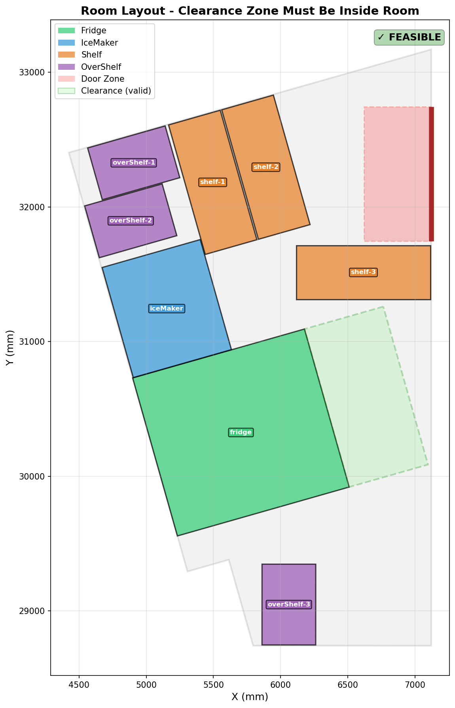
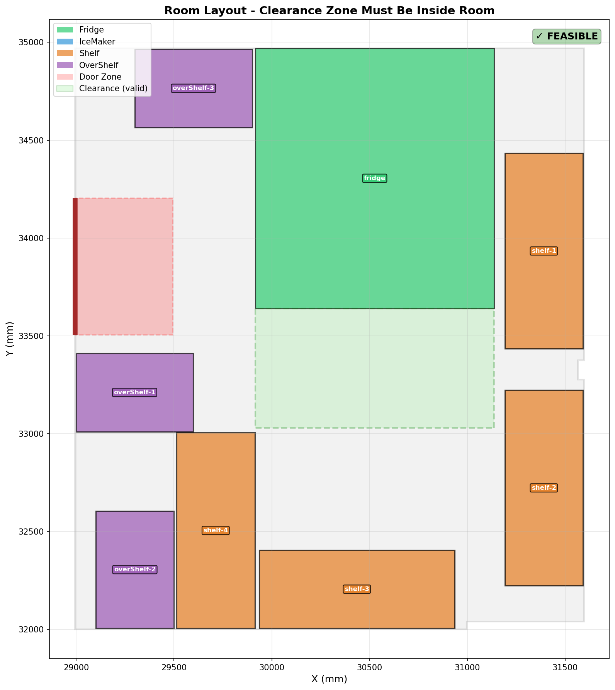
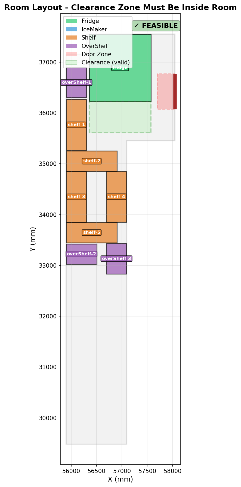
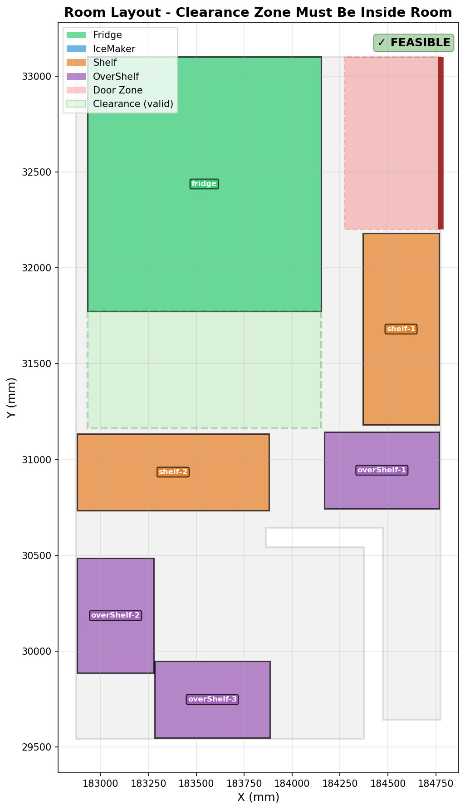

# 1. AI 工具的使用
## 1.1 所用AI介绍
- **QWen3.5-Plus**: **最初**拆解题目要求并尝试理解和构建解题思路
- **Doubao-Seed-Code**: 在以写好的test基础上去**更新完整代码逻辑**，并尝试理解
- **Deepseek-V3.2**: **重新拆解**理解题目，并尝试理解逻辑; 补充可视化部分代码
- **ChatGPT-5.3**: 帮助正确理清楚思路和**解答疑惑**的部分
- **Claude-4.6**: 拆解题目并**生成代码**，不断去调试并修改代码
## 1.2 AI 主要部分
- **ChatGPT-5**: 帮助正确理解完整的题目要求和不清楚的逻辑部分(对于非内开门时候，我是否需要设置一定的值去阻碍物品的放置; 是否要死盯题目中的length和width来进行解答，即便有些length要小于width; 对于放置部分我应该用什么样的大致逻辑来求解 ...)
- **Claude-4.6**: 帮助完成大部分代码，并进行逻辑介绍
## 1.3 个人贡献
- 将个人对于题目的理解讲述给AI **作为Prompt** 规范化部分处理逻辑
- 一次次去理解代码，并对代码进行微调后检查AI的不合理地方
- 将无法解决的问题再次抛给AI去理解并解决问题
- 设计可视化部分的框架，交给AI去优化并完善
- 最后对题目中细节的要求进行检查，补充一些细节要求
- **个人贡献的一些细节更多的在第4点中的代码逻辑解释之后**

# 2. 目录结构
project/  
├── main.py                      # 主程序文件  
├── 居灵-TakeHome工程题/           # 输入数据目录  
│   ├── example1.json  
│   ├── example2.json  
│   ├── example3.json  
│   ├── example4.json  
│   ├── image01.png  
│   ├── image02.png  
│   ├── image03.png  
│   ├── image04.png  
│   └── 题目要求.txt  
└── result/                      # 输出结果目录（自动创建）  
    ├── example1_result.json  
    ├── example2_result.json  
    ├── example3_result.json  
    ├── example4_result.json  
    ├── room_layout1.png  
    ├── room_layout2.png  
    ├── room_layout3.png  
    └── room_layout4.png  

# 3. 核心代码逻辑说明
## 3.1 整体架构
PlacementManager（放置管理器）  
├── DoorForbiddenZoneCalculator（门禁区计算器）  
├── WallEdgeDetector（墙边检测器）  
├── CollisionDetector（碰撞检测器）  
├── ItemPlacer（物品放置器）  
│ ├── FridgePlacer（冰箱放置器）  
│ └── WallItemPlacer（普通物品放置器）  
└── RoomVisualizer（可视化器）  
## 3.2 数据结构设计
| 数据类                | 用途      | 关键属性                                            |
|--------------------|---------|-------------------------------------------------|
| ItemDefinition     | 待放置物品定义 | name, length, width, clearance                  |
| PlacedItem         | 已放置物品记录 | polygon, center, rotation, clearance_zone       |
| WallEdge           | 墙边信息    | start, end, length, inward_normal, is_door_edge |
| PlacementCandidate | 放置候选位置  | center, rotation, polygon, score                |
## 3.3 核心算法流程
### 3.3.1 房间几何信息初始化
算法首先解析输入的房间数据，构建房间边界多边形，并检测所有墙边的属性  
- 将房间边界点转换为Shapely的 **Polygon对象**
- 遍历边界顶点，**计算每条墙边的长度、方向向量、角度**
- 计算每条墙边指向房间内部的法向量（通过测试点判断）
- 标记包含门的墙边
### 3.3.2 门禁区计算
根据门的位置和开启方向，计算门打开时占用的空间区域  
- 内开门：禁区深度为门宽度的一半，形成扇形区域的近似矩形
- 外开门：禁区深度固定为 500mm (根据与ChatGPT交流后自己定义的)，确保门外有足够通行空间
- 计算过程：
  1. 确定门的方向向量
  2. 计算指向房间内部的法向量
  3. 根据开门方向确定禁区深度
  4. 构建禁区的四边形多边形
### 3.3.3 物品优先级排序
按照以下优先级顺序放置物品，确保重要物品优先获得最佳位置

| 优先级 | 物品类型            |
|-----|-----------------|
| 0   | 冰箱 (Fridge)     |
| 1   | 制冰机 (IceMaker)  |
| 2   | 货架 (Shelf)      |
| 3   | 悬挂架 (OverShelf) |
同类型物品按**面积降序**排列，大物品优先放置
### 3.3.4 物品放置策略
**创建放置物品基类并继承两个类(冰箱放置类和普通物品放置类)**
**冰箱放置逻辑 (FridgePlacer)**
冰箱需要考虑开门净空区
1. 遍历所有非门边的墙边
2. 在每条足够长的墙边上均匀采样多个候选位置
3. 对每个候选位置：
   - 计算冰箱中心点（从墙面向内偏移 width/2）
   - 计算旋转角度（使背面贴墙）
   - 创建冰箱的矩形多边形
   - 创建净空区多边形（从冰箱前表面向内延伸）
4. 验证候选位置有效性并选择最佳位置
净空区计算公式：
- 净空区深度 = 冰箱长度 / 2
- 净空区位置：从冰箱前表面沿房间内部方向延伸
**普通物品放置逻辑 (WallItemPlacer)**
1. 遍历所有墙边（包括门边）
2. 对每条墙边尝试两种朝向：
   - 长度方向沿墙
   - 宽度方向沿墙
3. 在每种朝向下采样多个候选位置
4. 评估每个候选位置的得分：
   - 靠近已放置物品（紧凑布局加分）
   - 远离门（加分）
   - 非门边（加分）
5. 选择得分最高的有效位置
#### 3.3.5 碰撞检测
每次尝试放置物品时，CollisionDetector 执行全面的碰撞检测
1. **边界检测**：物品多边形必须完全在房间内
2. **净空区边界检测**：冰箱的净空区必须完全在房间内
3. **门禁区碰撞**：物品和净空区不能与门禁区重叠
4. **物品间碰撞**：
   - 新物品 vs 已放置物品
   - 新物品 vs 已放置物品的净空区
   - 新物品的净空区 vs 已放置物品
### 3.4 关键几何计算
#### 3.4.1 矩形多边形创建
1. 在原点创建矩形（中心在原点）
2. 旋转矩形
3. 平移到指定中心点
#### 3.4.2 净空区创建
1. 计算冰箱前表面中心点
2. 计算净空区中心点（继续沿内法向偏移）
3. 创建与冰箱前表面平行的矩形

# 4. 关键代码解析
## 4.1 门禁区计算
**核心代码**
```python
class DoorForbiddenZoneCalculator:
    def calculate_forbidden_zone(self) -> Polygon:
        # 计算门的方向向量和长度
        dx = self.door_end[0] - self.door_start[0]
        dy = self.door_end[1] - self.door_start[1]
        door_length = math.sqrt(dx * dx + dy * dy)

        # 计算单位方向向量
        door_direction = (dx / door_length, dy / door_length)

        # 计算两个可能的法向量（垂直于门的方向）
        normal_1 = (-door_direction[1], door_direction[0])  # 逆时针90度
        normal_2 = (door_direction[1], -door_direction[0])  # 顺时针90度

        # 确定哪个法向量指向房间内部
        inward_normal = self._determine_inward_normal(normal_1, normal_2)

        # 根据开门方向计算禁区深度
        if self.is_open_inward:
            # 内开门：禁区深度 = 门宽度的一半
            forbidden_depth = self.door_width / 2
        else:
            # 外开门：禁区深度 = 500mm
            forbidden_depth = 500.0

        # 构建禁区多边形
        forbidden_zone = self._build_forbidden_zone_polygon(
            self.door_start,
            self.door_end,
            inward_normal,
            forbidden_depth
        )

        return forbidden_zone
```
**代码解释**
- 该方法计算门打开时的禁止区域，确保物品不会阻挡门的正常开启
- 首先计算门的方向向量和单位向量
- 计算两个可能的法向量（垂直于门的方向）
- 通过测试点确定哪个法向量指向房间内部
- 根据门的开启方向确定禁区深度：内开门为门宽的一半，外开门为固定500mm
- 构建禁区多边形，形成一个四边形区域   

**个人贡献部分**
- 该类的框架由AI构成，但是计算部分是存在问题的(AI给到的解答是计算了门内和门外两个方向的禁止方向，并且没有进行false情况下的禁止空间设置)
- 因此我创建了 `_determine_inward_normal`方法用来计算门内的法向量
- 并且设计了如果为false情况下也要设计500mm的禁止区域

## 4.2 墙边检测
**核心代码**
```python
class WallEdgeDetector:
    def detect_edges(self, door_line: LineString) -> List[WallEdge]:
        # 获取边界顶点坐标
        coords = list(self.boundary.exterior.coords)
        edges = []

        # 遍历每对相邻顶点
        for i in range(len(coords) - 1):
            start = coords[i]
            end = coords[i + 1]

            # 计算边的属性
            edge = self._compute_edge_properties(start, end)
            edges.append(edge)

        # 按长度降序排序
        edges.sort(key=lambda e: -e.length)

        return edges

    def _compute_edge_properties(self, start: Tuple[float, float], end: Tuple[float, float]) -> WallEdge:
        # 计算边的向量
        dx = end[0] - start[0]
        dy = end[1] - start[1]
        length = math.sqrt(dx * dx + dy * dy)

        # 计算单位方向向量
        if length > 0:
            direction_vector = (dx / length, dy / length)
        else:
            direction_vector = (0, 0)

        # 计算与X轴的夹角（度）
        angle = math.degrees(math.atan2(dy, dx))

        # 计算指向房间内部的法向量
        inward_normal = self._calculate_inward_normal(start, end, direction_vector)

        # 检查这条边是否包含门
        is_door_edge = self._check_if_door_edge(start, end, self.door_start, self.door_end)

        # 创建边的线段表示
        line = LineString([start, end])

        return WallEdge(
            start=start,
            end=end,
            length=length,
            direction_vector=direction_vector,
            angle=angle,
            inward_normal=inward_normal,
            is_door_edge=is_door_edge,
            line=line
        )
```
**代码解释**
- `detect_edges` 方法遍历房间边界的所有顶点，构建墙边列表
- 对每条边调用 `_compute_edge_properties` 计算详细属性(长度、角度等)
- 计算边的长度、方向向量、与X轴的夹角
- 确定指向房间内部的法向量
- 检查边是否包含门（使用投影距离判断）
- 最后按边长度降序排序，优先考虑长墙  

**个人贡献部分**
- 对于 **检查是否包含门类** `_check_if_door_edge`这个方法中AI给的解答方式并不够好(找到中心点，然后比较中心点与门的距离是否小于阈值，小于就是包含门的边)
- 修正为投影距离法来判断，这种方法比上一种方法稍微靠谱一点

## 4.3 几何工具类
**核心代码**
```python
class GeometryUtils:
    @staticmethod
    def create_rectangle_polygon(center: Tuple[float, float], length: float, width: float, rotation: float) -> Polygon:
        # 创建以原点为中心的矩形
        half_length = length / 2
        half_width = width / 2
        rectangle_at_origin = box(-half_length, -half_width, half_length, half_width)

        # 旋转矩形
        rotated_rectangle = rotate(rectangle_at_origin, rotation, origin=(0, 0))

        # 平移到指定位置
        final_rectangle = translate(rotated_rectangle, center[0], center[1])

        return final_rectangle

    @staticmethod
    def create_clearance_zone(center: Tuple[float, float], length: float, width: float, inward_normal: Tuple[float, float], clearance_depth: float) -> Polygon:
        # 计算冰箱前表面的中心点
        front_center_x = center[0] + inward_normal[0] * (width / 2)
        front_center_y = center[1] + inward_normal[1] * (width / 2)

        # 计算净空区的中心点
        clearance_center_x = front_center_x + inward_normal[0] * (clearance_depth / 2)
        clearance_center_y = front_center_y + inward_normal[1] * (clearance_depth / 2)

        # 计算旋转角度
        rotation = math.degrees(math.atan2(inward_normal[1], inward_normal[0]))

        # 创建净空区矩形
        half_length = length / 2
        half_depth = clearance_depth / 2

        # 创建以原点为中心的矩形
        clearance_rect = box(-half_length, -half_depth, half_length, half_depth)

        # 旋转矩形使其法向对齐
        clearance_rect = rotate(clearance_rect, rotation + 90, origin=(0, 0))

        # 平移到计算出的中心点
        clearance_rect = translate(clearance_rect, clearance_center_x, clearance_center_y)

        return clearance_rect
```
**代码解释**
- `create_rectangle_polygon` 方法创建任意位置、旋转角度的矩形多边形
  1. 首先在原点创建中心矩形
  2. 按指定角度旋转
  3. 平移到目标位置
- `create_clearance_zone` 方法创建冰箱的净空区
  1. 计算冰箱前表面中心点（从中心沿内法向偏移width/2）
  2. 计算净空区中心点（从前表面中心继续沿内法向偏移clearance_depth/2）
  3. 创建与冰箱前表面平行的矩形净空区  

**个人贡献部分**
- 在`create_clearance_zone` 方法中，AI总是计算错误，AI无法正确理解到应该如何寻找到冰箱打开所需要的净空区域，所以在计算时候总是将width与length搞反，并且在创建净空区矩形之后没有进行旋转与冰箱打开方向对其
- `create_clearance_zone` 基本上是个人独立完成的，并且对于旋转矩形其实我也是依靠可视化来理解的，最初我也没有意识到需要旋转
- 只要与冰箱有关的部分，基本上AI都是无法正确理解的，因为这道题的length是小于width的，并且打开面是length，所以就需要不断的去理解放置之后的大致方向
- 比如length边打开的话，那么基本上就是length边靠墙的，那么要找冰箱中点、前表面中点和净空区的中点，三个移动所需要增加的长度是不同的，这部分需要人为来处理

## 4.4 碰撞检测
**核心代码**：
```python
class CollisionDetector:
    def check_placement_valid(self, item_polygon: Polygon, clearance_zone: Optional[Polygon] = None, area_threshold: float = 100.0) -> bool:
        # 检查物品是否完全在房间内
        if not GeometryUtils.is_polygon_fully_inside(item_polygon, self.room_boundary):
            return False

        # 检查净空区是否完全在房间内
        if clearance_zone is not None:
            if not GeometryUtils.is_polygon_fully_inside(clearance_zone, self.room_boundary):
                return False

        # 检查是否与门禁区碰撞
        if self._check_door_collision(item_polygon, clearance_zone, area_threshold):
            return False

        # 检查是否与已放置物品碰撞
        if self._check_item_collisions(item_polygon, clearance_zone, area_threshold):
            return False

        return True

    def _check_item_collisions(self, item_polygon: Polygon, clearance_zone: Optional[Polygon], area_threshold: float) -> bool:
        for placed_item in self.placed_items:
            # 检查新物品 vs 已放置物品
            if item_polygon.intersects(placed_item.polygon):
                intersection = item_polygon.intersection(placed_item.polygon)
                if intersection.area > area_threshold:
                    return True

            # 检查新物品 vs 已放置物品的净空区
            if placed_item.clearance_zone is not None:
                if item_polygon.intersects(placed_item.clearance_zone):
                    intersection = item_polygon.intersection(placed_item.clearance_zone)
                    if intersection.area > area_threshold:
                        return True

            # 检查新物品的净空区 vs 已放置物品
            if clearance_zone is not None:
                if clearance_zone.intersects(placed_item.polygon):
                    intersection = clearance_zone.intersection(placed_item.polygon)
                    if intersection.area > area_threshold:
                        return True

        return False
```
**代码解释**：
- `check_placement_valid` 方法执行全面的碰撞检测
  1. 检查物品是否完全在房间内
  2. 检查净空区（如果有）是否完全在房间内
  3. 检查是否与门禁区碰撞
  4. 检查是否与已放置物品碰撞
- `_check_item_collisions` 方法检查与已放置物品的碰撞
  - 检查新物品与已放置物品的碰撞
  - 检查新物品与已放置物品净空区的碰撞
  - 检查新物品净空区与已放置物品的碰撞
- 使用面积阈值判断碰撞是否有效，避免微小重叠被误判

**个人贡献部分**
- 在执行碰撞检测时候，AI自然而然的将离地置物架叠放在了其他物品之上，所以就需要在这里对这部分代码进行微调，并增加函数检查
- 对于`_check_item_collisions` 方法，最初设置的阈值是比较大的，这就导致有些情况会超出轮廓或者与物品碰撞，所以这里就需要对其进行调整，调整为完全的严格的检查

## 4.5 物品放置逻辑
**冰箱放置逻辑**：
```python
class FridgePlacer(ItemPlacer):
    def place(self, item_def: ItemDefinition, wall_edges: List[WallEdge]) -> Optional[PlacementCandidate]:
        best_candidate = None

        # 净空深度（默认为610mm）
        clearance_depth = item_def.clearance or 610
        
        # 遍历所有墙边
        for edge in wall_edges:
            # 跳过门边（不能将冰箱放在门边）
            if edge.is_door_edge:
                continue
                
            # 检查墙边长度是否足够容纳冰箱长度
            min_required_length = item_def.length
            if edge.length < min_required_length:
                continue
                
            # 在墙上采样多个位置
            candidates = self._sample_positions_on_edge(
                edge, item_def, clearance_depth
            )
            
            # 评估每个候选位置
            for candidate in candidates:
                # 检查放置是否有效
                if self.collision_detector.check_placement_valid(
                        candidate.polygon, candidate.clearance_zone
                ):
                    # 计算评分
                    candidate.score = self._calculate_score(
                        candidate.center, edge
                    )

                    # 更新最佳候选
                    if best_candidate is None or candidate.score > best_candidate.score:
                        best_candidate = candidate

        return best_candidate
```
**普通物品放置逻辑**：
```python
class WallItemPlacer(ItemPlacer):
    def place(self, item_def: ItemDefinition, wall_edges: List[WallEdge]) -> Optional[PlacementCandidate]:
        best_candidate = None

        # 遍历所有墙边
        for edge in wall_edges:
            # 尝试两种可能的朝向
            for orientation in ['length_along_wall', 'width_along_wall']:
                candidates = self._sample_positions_on_edge(
                    edge, item_def, orientation
                )

                # 评估每个候选位置
                for candidate in candidates:
                    if self.collision_detector.check_placement_valid(
                            candidate.polygon, None
                    ):
                        candidate.score = self._calculate_score(
                            candidate.center, candidate.polygon, edge
                        )

                        if best_candidate is None or candidate.score > best_candidate.score:
                            best_candidate = candidate

        return best_candidate
```
**代码解释**：
- **冰箱放置**：
  1. 遍历所有非门边的墙边
  2. 跳过长度不足的墙边
  3. 在每条墙上采样多个候选位置
  4. 为每个位置创建冰箱多边形和净空区
  5. 检查碰撞并计算评分
  6. 选择最佳位置
- **普通物品放置**：
  1. 遍历所有墙边（包括门边）
  2. 尝试两种朝向：长度沿墙和宽度沿墙
  3. 在每种朝向下采样多个位置
  4. 检查碰撞并计算评分（考虑紧凑布局、远离门、非门边等因素）
  5. 选择最佳位置

**个人贡献部分**
- 这里AI处理的是很好的，用不断遍历的方式，并且去设计优先放置原则和评分系统去判断每个可防止地方的得分性，从而得到最好的解答
- 这里就是不断去理解AI的逻辑，去理解代码原理和寻求为什么要这样去设计

## 4.6 放置管理器
**核心代码**：
```python
class PlacementManager:
    # 物品放置优先级
    PRIORITY_ORDER = {
        ItemType.FRIDGE: 0,
        ItemType.ICE_MAKER: 1,
        ItemType.SHELF: 2,
        ItemType.OVER_SHELF: 3
    }

    def place_all_items(self) -> dict:
        # 步骤1: 按优先级排序
        sorted_items = self._sort_items_by_priority()

        # 步骤2: 按顺序放置每个物品
        for item_def in sorted_items:
            # 创建对应的放置器
            placer = self._create_placer_for_item(item_def)

            # 尝试放置物品
            candidate = placer.place(item_def, self.wall_edges)

            if candidate is not None:
                # 放置成功，创建已放置物品记录
                placed_item = PlacedItem(
                    name=item_def.name,
                    polygon=candidate.polygon,
                    center=candidate.center,
                    rotation=candidate.rotation,
                    length=item_def.length,
                    width=item_def.width,
                    item_type=item_def.type,
                    clearance_zone=candidate.clearance_zone
                )

                # 添加到列表和碰撞检测器
                self.placed_items.append(placed_item)
                self.collision_detector.add_placed_item(placed_item)

                # 记录结果
                self.results[item_def.name] = {
                    'center': list(candidate.center),
                    'rotation': candidate.rotation % 360
                }
            else:
                # 放置失败
                self.results[item_def.name] = None

        return self.results

    def _sort_items_by_priority(self) -> List[ItemDefinition]:
        def get_priority(item_def: ItemDefinition) -> tuple:
            type_priority = self.PRIORITY_ORDER.get(item_def.type, 99)
            # 面积大的优先级高（所以用负值）
            area_priority = -item_def.area
            return (type_priority, area_priority)

        return sorted(self.item_definitions, key=get_priority)
```
**代码解释**：
- `PlacementManager` 是整个系统的核心，负责协调各个组件
- `place_all_items` 方法按优先级顺序放置所有物品
  1. 首先调用 `_sort_items_by_priority` 按类型和面积排序
  2. 为每个物品创建对应的放置器
  3. 尝试放置物品并记录结果
  4. 将成功放置的物品添加到碰撞检测器中
- `_sort_items_by_priority` 方法实现优先级排序逻辑
  - 按物品类型优先级（冰箱最高）
  - 同类型按面积降序（大物品优先）

# 5. 运行环境及运行方式
## 5.1 运行环境要求
**Python 版本**：Python 3.8 或更高版本
**依赖库**

|库名称|版本要求|用途|
|---|---|---|
|shapely|>=2.0.0|几何计算和碰撞检测|
|matplotlib|>=3.5.0|结果可视化|

## 5.2 环境安装
```python
# 创建虚拟环境（可选）
python -m venv venv
source venv/bin/activate  # Linux/Mac
# 或 venv\Scripts\activate  # Windows

# 安装依赖
pip install shapely matplotlib
```

## 5.3 运行方式
```python
# 直接运行主程序
python main.py
```
程序将自动  
1. 读取 ../居灵-TakeHome工程题/ 目录下的所有示例 JSON 文件
2. 对每个示例执行物品放置算法
3. 将结果保存到 ./result/ 目录
4. 生成可视化图像

## 5.4 输入数据格式
```json
{
    "boundary": [[x1, y1], [x2, y2], ...],  // 房间边界点
    "door": [[x1, y1], [x2, y2]],           // 门的起点和终点
    "isOpenInward": true,                    // 门是否向内开
    "algoToPlace": {                         // 待放置物品
        "物品名称": [长度, 宽度],
        ...
    }
}
```
## 5.5 输出数据格式
```json
{
    "物品名称": {
        "center": [x, y],      // 放置中心点坐标（毫米）
        "rotation": angle      // 旋转角度（度，0-360）
    },
    ...
    "feasible": true/false     // 是否可行
}
```
若物品无法放置，对应值为 `null`

## 5.6 输出示例
### 1. emample1
- 输出结果 (example1_result.json)
```json
{
  "fridge": {
    "center": [
      5704.982071904413,
      30325.405903778974
    ],
    "rotation": 105.85199939798602
  },
  "iceMaker": {
    "center": [
      5152.630610773046,
      31245.569439007875
    ],
    "rotation": 195.85199939798602
  },
  "shelf-1": {
    "center": [
      5494.786206078236,
      32183.350006313976
    ],
    "rotation": 105.85200131929506
  },
  "shelf-2": {
    "center": [
      5890.734092035599,
      32295.780199324323
    ],
    "rotation": 105.85200131929506
  },
  "shelf-3": {
    "center": [
      6616.7357,
      31514.06677159091
    ],
    "rotation": 0.0
  },
  "overShelf-1": {
    "center": [
      4906.526371266169,
      32328.172333825445
    ],
    "rotation": 15.852001319295063
  },
  "overShelf-2": {
    "center": [
      4884.316210407225,
      31897.622572187393
    ],
    "rotation": 195.85199939798602
  },
  "overShelf-3": {
    "center": [
      6061.86376590577,
      29047.26339799267
    ],
    "rotation": 269.97462095513447
  },
  "feasible": true
}
```


### 2. emample2
- 输出结果 (example2_result.json)
```json
{
  "fridge": {
    "center": [
      30526.35440909091,
      34305.0295
    ],
    "rotation": 180.0
  },
  "shelf-1": {
    "center": [
      31391.3885,
      33933.6062516129
    ],
    "rotation": 90.0
  },
  "shelf-2": {
    "center": [
      31391.3885,
      32722.807045833335
    ],
    "rotation": 90.0
  },
  "shelf-3": {
    "center": [
      30435.101000000002,
      32205.0295
    ],
    "rotation": 0.0
  },
  "shelf-4": {
    "center": [
      29713.076,
      32505.0295
    ],
    "rotation": 90.0
  },
  "overShelf-1": {
    "center": [
      29298.3885,
      33210.38664285714
    ],
    "rotation": 0.0
  },
  "overShelf-2": {
    "center": [
      29299.751,
      32305.0295
    ],
    "rotation": 90.0
  },
  "overShelf-3": {
    "center": [
      29599.58168181818,
      34765.0295
    ],
    "rotation": 180.0
  },
  "feasible": true
}
```


### 3. emample3
- 输出结果 (example3_result.json)
```json
{
  "fridge": {
    "center": [
      56964.45235714286,
      36888.106
    ],
    "rotation": 0.0
  },
  "shelf-1": {
    "center": [
      56103.3095,
      35765.754058823535
    ],
    "rotation": 90.0
  },
  "shelf-2": {
    "center": [
      56403.3095,
      35052.02856862745
    ],
    "rotation": 180.0
  },
  "shelf-3": {
    "center": [
      56103.3095,
      34348.69523529412
    ],
    "rotation": 90.0
  },
  "shelf-4": {
    "center": [
      56893.3095,
      34350.62712184874
    ],
    "rotation": 270.0
  },
  "shelf-5": {
    "center": [
      56403.3095,
      33646.146215686276
    ],
    "rotation": 180.0
  },
  "overShelf-1": {
    "center": [
      56103.3095,
      36598.107
    ],
    "rotation": 90.0
  },
  "overShelf-2": {
    "center": [
      56203.3095,
      33224.38150980392
    ],
    "rotation": 180.0
  },
  "overShelf-3": {
    "center": [
      56893.3095,
      33132.3920882353
    ],
    "rotation": 270.0
  },
  "feasible": true
}
```


### 4. emample4
- 输出结果 (example4_result.json)
```json
{
  "fridge": {
    "center": [
      183541.22397894735,
      32437.723100000003
    ],
    "rotation": 0.0
  },
  "shelf-1": {
    "center": [
      184568.5924,
      31680.549186956523
    ],
    "rotation": 270.0
  },
  "shelf-2": {
    "center": [
      183378.5924,
      30934.095649019608
    ],
    "rotation": 180.0
  },
  "overShelf-1": {
    "center": [
      184468.5924,
      30943.737592753623
    ],
    "rotation": 0.0
  },
  "overShelf-2": {
    "center": [
      183078.5924,
      30185.2231
    ],
    "rotation": 90.0
  },
  "overShelf-3": {
    "center": [
      183583.5924,
      29747.7231
    ],
    "rotation": 180.0
  },
  "feasible": true
}
```


# 6. 个人总结
- 对于这道题，最初拿到这道题，我是无法准确读懂题目的，甚至无法准确理解放置在轮廓是什么概念，后来看到样例图片明白是在二维的环境中去设计这道题
- 之后进行初步尝试去解答这道题，首先就是按类别去设计出来不同的类，但是我并不知道有Shapely库，甚至设计出来了Point类，然后去尝试各种限制条件如何用代码表示，比如门禁止区域，冰箱打开净空区域，然后物品如何尝试不同的地方进行放置，物品之间的禁止区域如何防止放置等等
- 但是第一次去尝试解答后我发现我对于题目的理解不够，我无法理解为什么冰箱是要这样设计，那么打开的面前面是一点都不能放置吗；对于门，如果不是内开门我可以挨着门防止吗；我用什么方法可以不断尝试可以防止的地方啊
- 然后前前后后去分析题目大概有5、6次，最后才有了自己的一套逻辑理解，并且将理解作为Prompt不断去调试AI
- 这道题准确来讲，我并没有自己来完成，而是依靠AI去一遍遍打磨代码，然后我自己去理解AI的逻辑检查漏洞才完成的，并且很多地方的库函数我要一直去问AI"这个函数作用是什么，为什么要这样做"
- 但是不得不承认，这道题确实让我头大了很久，我从3/5的12点打开一直到现在3/6的20点，基本上就没有停止过对这道题的解答，最终，很有幸的依靠Claude来完成了这个工程题
- 如果这就是您每天要面对的问题的话，我说实话我如果不依赖AI是完全不可能独立完成的，并且这一次次调试后我也明白我对于AI的调用和不同的AI的侧重点是不够的，并且我仅仅知道主流的AI如何使用，可能有更好的AI可以帮助我理解并解答这道题，但是我却不知道
- 其实和您讲，就在昨天半夜我还依然在痛苦地想，这真的可以解出来吗？我要不放弃算了，等等；虽然我不知道我现在的解答是否正确，但是我想，目前就是我尽力后的结果了，我对于任何结果都将坦然接受的
- 这道题很好的锤炼了我，也让我知道我依然有着不断去挑战问题，不服输的精神，很感谢您的这道题，依然让我充满了对自己未来的信心！